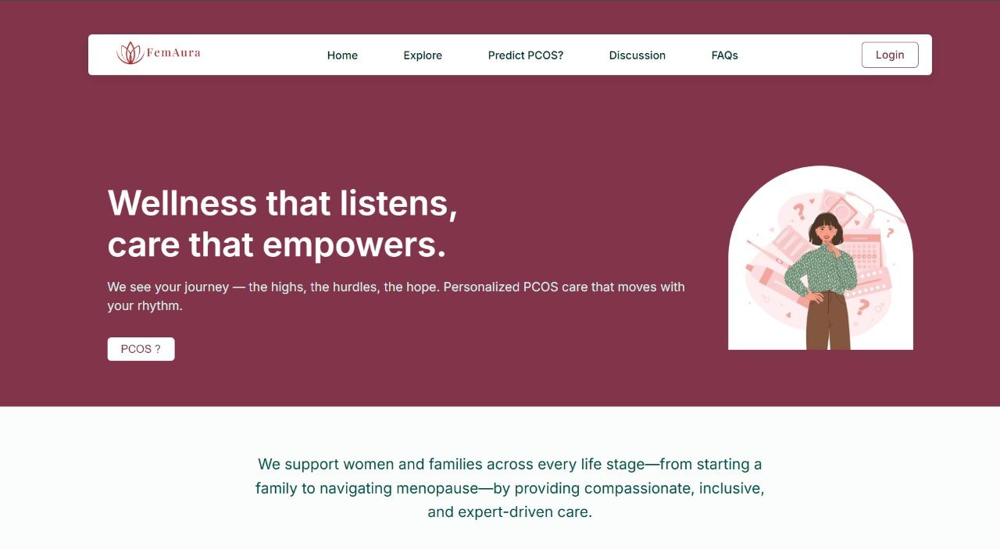
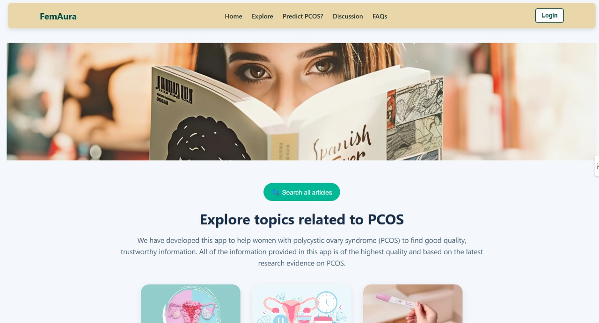
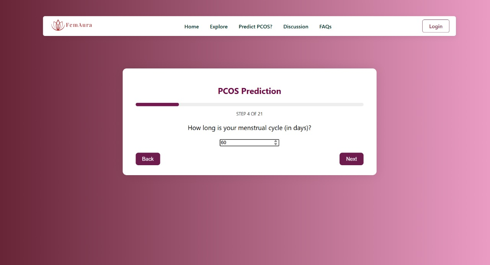
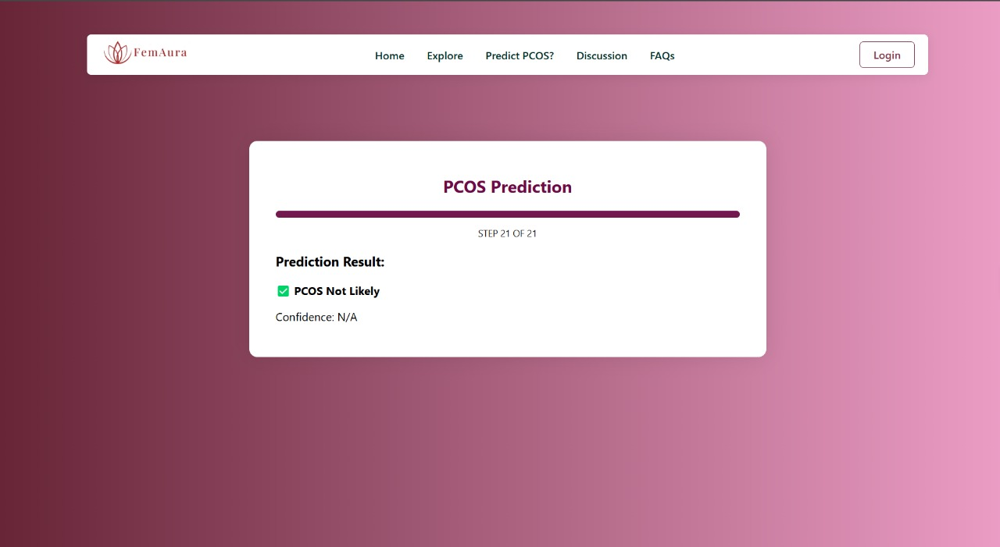

# 🛡️ FemAura - Balance within, Wellness beyond
### "Empowering women with PCOS through awareness and detection, personalized health tracking, and holistic well-being solutions."

* What is PCOS(Polycystic Ovarian Syndrome)?
* Features
* PCOS Detection 
* Tech Stack we used 
* Glimpse of Project
* Future Plans for Project  
* Team Members

# 🩺 What is PCOS (Polycystic Ovarian Syndrome)? 
> "One in five(20%) Indian women suffers from PCOS" ~ The Hindu.
* PCOS (Polycystic Ovary Syndrome) is a hormonal disorder affecting women of reproductive age.
* It involves small ovarian cysts, hormonal imbalances, and excess androgens.
* Common symptoms include irregular periods, excessive hair growth, acne, and weight gain.
* Insulin resistance also contributes to its development.

> PCOS is the leading cause of infertility in women.
* In India, the incidence of PCOS is higher among urban women than rural women.
* Liestyle changes, such as a healthy diet and regular exercise, can help manage PCOS symptoms.
> while there is no cure for PCOS, early diagnosis and management can improve quality of life and prevent long-term health complications such as diabetes and heart disease.

# 🌟 Features:
* **PCOS Detection**: ML model analyzes user input to assess PCOS risk and recommend doctor consultation.

* **Symptom Tracking**: Monitor PCOS-related symptoms to identify health patterns early.

* **Gynecologist AI Bot**: Chatbot offering gynecological advice, answers, and emotional support.

* **Personalized Fitness & Nutrition**: Customized fitness and diet plans for a healthier lifestyle.

# 🔍 PCOS-Detection:
| Model | Accuracy | 
| --- | --- |
| Logistic Regression | 55% |
| Decision Tree | 48% | 
| Support Vector Machine | 54% | 
| Random Forest Classifier | 63% |
| XG Boost | 76% | 

* Performed Data Preprocessing, Data Analysis, applied Scaling, tried models like Logistic Regression, SVM, Decision Tree, Random Forest Classfier, XG Boost.
* This model uses XG Boost + SMOTE to classify whether the person has high chances of PCOS and should reach out to a doctor.
* We are using following features:
    `[
        'Age', 
        'Height (cm)', 
        'Weight (kg)', 
        'BMI', 
        'Cycle Length (days)', 
        'Cycle Regular (1=Yes, 0=No)', 
        'Missed Period (1=Yes, 0=No)', 
        'Marital Status (1=Married, 0=Unmarried)', 
        'Hirsutism (1=Yes, 0=No)', 
        'Hair Thinning (1=Yes, 0=No)', 
        'Acne (1=Yes, 0=No)', 
        'Skin Darkening (1=Yes, 0=No)', 
        'Pelvic Pain (1=Yes, 0=No)', 
        'Weight Gain (1=Yes, 0=No)', 
        'Difficulty in Conceiving (1=Yes, 0=No)', 
        'Exercise (1=Regular, 0=No)', 
        'Stress Level (1-5)', 
        'Sugar Craving (1=Yes, 0=No)', 
        'Sleep Well (1=Yes, 0=No)', 
        'Mood Swings (1=Yes, 0=No)', 
        'Family History of PCOS (1=Yes, 0=No)', 
        'Avg Menstrual Duration (days)'
    ]`
       
* Model's GitHub Link: https://github.com/Khushi-Singh25/FemAura_Model
* Model's Deployed Link: https://femaura-api.onrender.com/
* Dataset Link: 1) https://www.kaggle.com/datasets/prasoonkottarathil/polycystic-ovary-syndrome-pcos?select=PCOS_data_without_infertility.xlsx
                2) https://www.kaggle.com/datasets/prasoonkottarathil/polycystic-ovary-syndrome-pcos?select=PCOS_infertility.csv
                3) https://1drv.ms/x/c/9d3d9964f4e1f380/Ee4EfFiQc-tAnJfkqZh4UnYBheeAjAedgXtBv1rUE1vw7A?e=jHvsTO

# 🛠️ Tech Stack:
* Machine Learning-
  * Python: Pandas, Numpy, Sklearn, Matplotlib
  * Model: XG Boost + SMOTE
* Frontend-
  * HTML
  * CSS
  * JavaScript
* Backend-
  * Node.js
  * Express.js
  * JWT and Firebase 
  * MongoDB

# 📸 Glimpse of Project:

# 🚀 Future Vision of the Project:
* **Improved Accuracy**: Incorporate advanced ensemble trained models and larger, diverse datasets.
* **Mobile App Integration**: Enable real-time tracking and easier access to the users via smartphones.
* **SHAP Explainability**: Help users understand model decisions clearly for transparency and trust. 

# 👩‍💻 Team Members

| Name | GitHub Profile |
|:----:|:--------------:|
| Divyansh Trivedi | [@divyansh-trivedi](https://github.com/divyansh-trivedi) |
| Aadvi Singh | [@aadvisingh04](https://github.com/aadvisingh04) |
| Khushi Singh  | [@Khushi-Singh25](https://github.com/Khushi-Singh25) |
